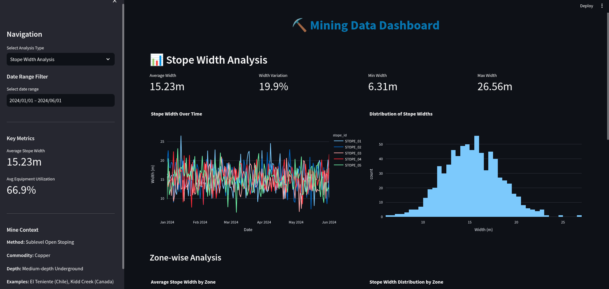
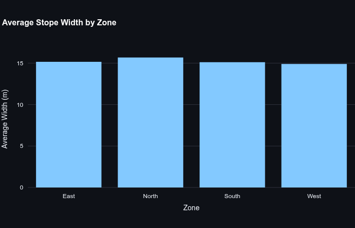
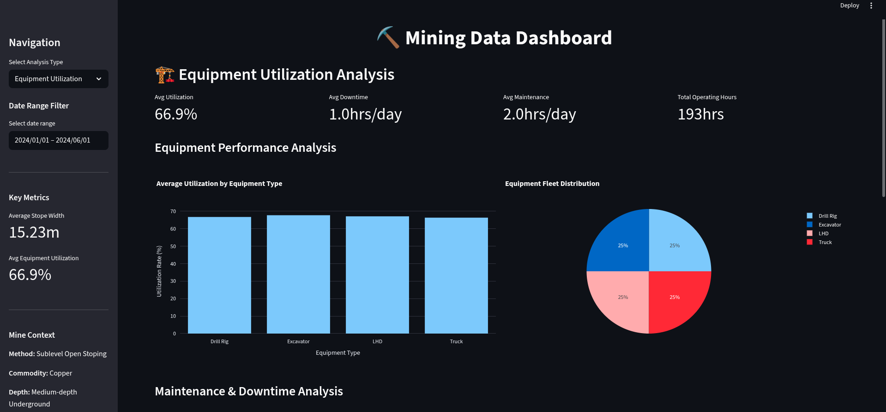
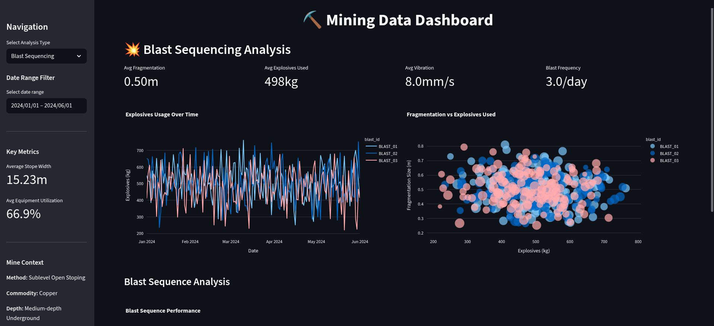
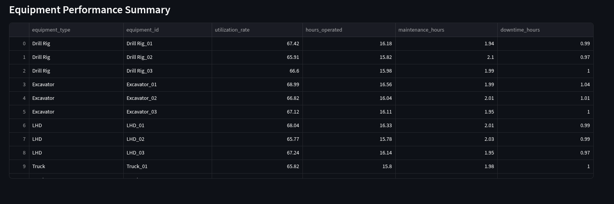
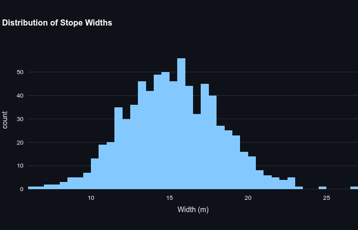
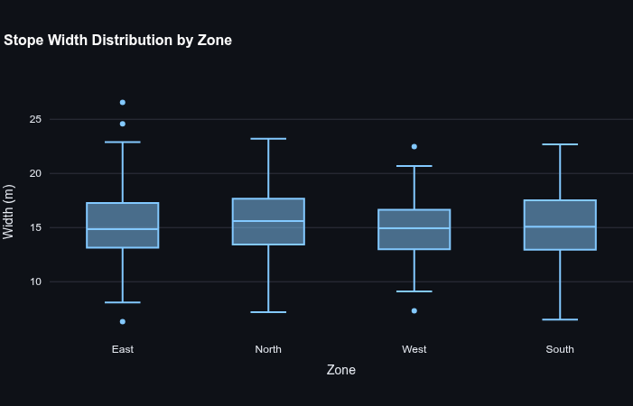
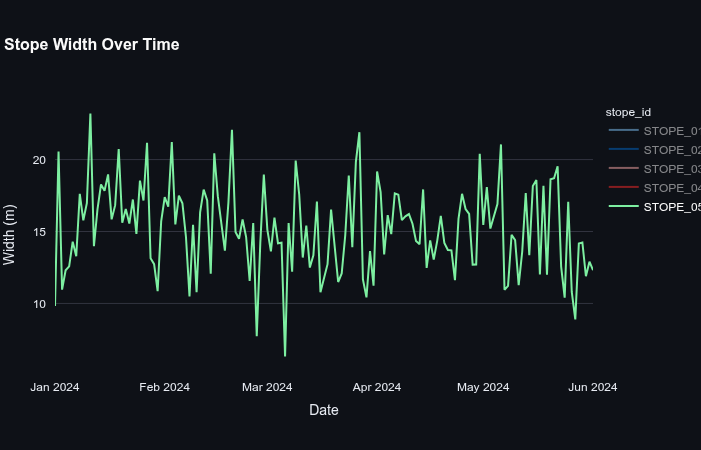
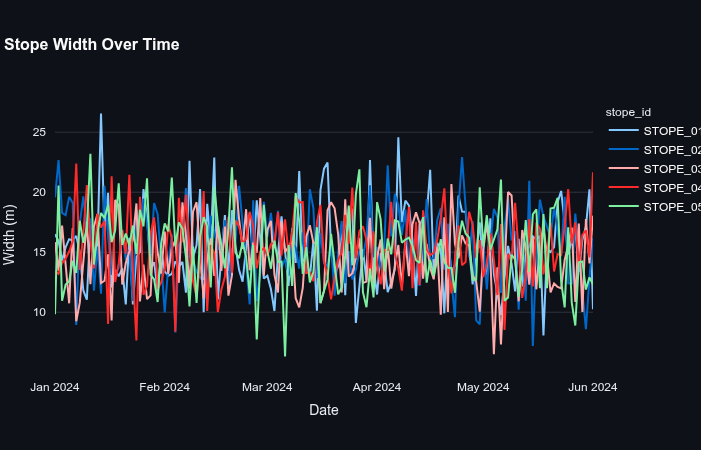

# ⛏️ Mining Data Dashboard


A comprehensive Streamlit-based dashboard for analyzing mining operations data, including stope widths, blast sequencing, and equipment utilization.

## 📸 Dashboard Screenshots

### Main Dashboard Overview


### Core Analysis Sections
| Stope Width Analysis | Equipment Utilization |
|---------------------|----------------------|
|  |  |

| Blast Sequencing | Equipment Performance |
|------------------|----------------------|
|  |  |

### Technical Analysis
| Distribution Analysis | Zone Analysis |
|----------------------|---------------|
|  |  |

| Individual Stope Tracking | Multi-Stope Comparison |
|--------------------------|------------------------|
|  |  |

## 🎯 Key Insights from Sample Data

Based on the generated mining data, this dashboard reveals:
- **Average stope width**: 15.23m (typical for bulk mining operations)
- **Equipment utilization**: 66.9% (good operational efficiency)  
- **Width variation**: 19.9% (moderate geological consistency)
- **Zone performance**: Comparative analysis across North, South, East, West zones

## 📊 Features

### 1. Stope Width Analysis
- Real-time monitoring of stope width variations
- Zone-wise analysis and comparisons
- Statistical analysis and trend identification
- Distribution analysis across different mining zones

### 2. Blast Sequencing Analysis
- Explosives usage tracking and optimization
- Fragmentation size analysis
- Vibration level monitoring
- Sequence performance evaluation

### 3. Equipment Utilization
- Utilization rate monitoring across equipment types
- Maintenance and downtime analysis
- Fuel consumption tracking
- Performance metrics by equipment ID

## 🛠️ Tech Stack

- **Python 3.8+**
- **Pandas** - Data manipulation and analysis
- **Streamlit** - Web application framework
- **Plotly** - Interactive visualizations
- **NumPy** - Numerical computations

## 🚀 Installation

1. Clone the repository:
```bash
git clone https://github.com/Axulo-Inc/mining-data-dashboard.git
cd mining-data-dashboard

2. Install required packages:
pip install -r requirements.txt

3. Run the application:
streamlit run app.py

## 📁 Project Structure

\`\`\`
mining-data-dashboard/
├── app.py                 # Main Streamlit application
├── requirements.txt       # Python dependencies
├── README.md             # Project documentation
├── screenshots/          # Dashboard screenshots
├── utils/
│   ├── data_loader.py    # Data generation and loading
│   └── calculations.py   # Statistical calculations
└── components/
    ├── stope_analysis.py      # Stope width analysis components
    ├── blast_sequencing.py    # Blast sequencing components
    └── equipment_utilization.py # Equipment utilization components
\`\`\`

## 🎯 Usage

1. **Navigation**: Use the sidebar to switch between different analysis types
2. **Date Filtering**: Filter data by date range using the sidebar controls
3. **Interactive Charts**: Hover over charts for detailed information
4. **Real-time Metrics**: View key performance indicators in the sidebar

## 📈 Data Sources

The dashboard supports both:
- Sample Data: Automatically generated realistic mining data
- Real CSV Data: Import your own mining operation data by placing CSV files in the data/ directory

## 🔧 Customization

To use with your own data:
1. Replace the data generation functions in \`utils/data_loader.py\`
2. Modify the data processing in component files
3. Update visualization parameters as needed

## 🤝 Contributing

1. Fork the project
2. Create your feature branch (\`git checkout -b feature/AmazingFeature\`)
3. Commit your changes (\`git commit -m 'Add some AmazingFeature'\`)
4. Push to the branch (\`git push origin feature/AmazingFeature\`)
5. Open a Pull Request

## 📄 License

This project is licensed under the MIT License - see the LICENSE file for details.

## 👥 Authors

- **Thabang Motsoahae** - [Axulo-Inc](https://github.com/Axulo-Inc)
## 🙏 Acknowledgments

- Streamlit team for the amazing framework
- Plotly for interactive visualizations
- Pandas community for data analysis tools
